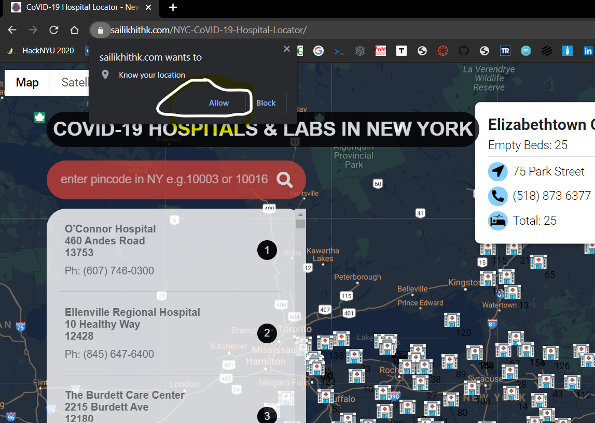
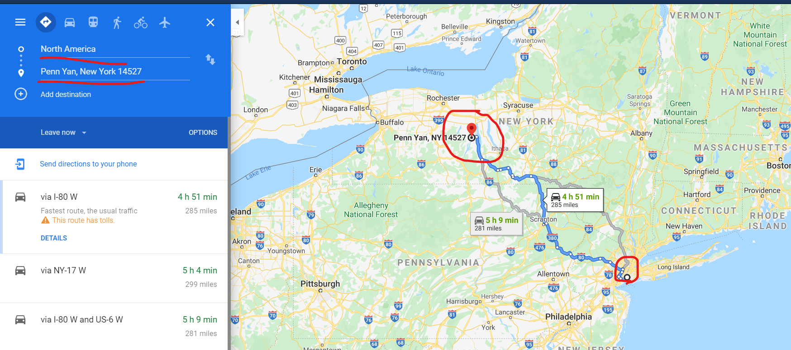

# NYC-CoVID-19-Hospital-Locator
This web application has the hospitals and its bed counts, vacant beds build over Google MAPs API, with HTML, CSS, JavaScript

# Impact of this project
In this COVID-19 times, many people who got affected, needs to know which hospital they need to go so that they can choose which hospital is having empty beds. Seeing this, I decided to find a solution using **technology**. Here I am with the project which can help people to track the no.of empty beds time to time.

# Web Application Demo

<a href="https://sailikhithk.com/NYC-CoVID-19-Hospital-Locator/" target="_blank">Live Demo</a>

# **Demo Video**

# Features of the project
* **Location**

* **Empty Beds**

* **Redirection to Google Maps from your location towards hospital you choose**

## Grab most of this application using these steps

<ol>
  <li>Click On <a href="https://sailikhithk.com/NYC-CoVID-19-Hospital-Locator/" target="_blank">Live Demo</a></li>
  <li>It shall ask your location to show you distance between your location and the hospital</li>
  <li>Now just hover your mouse button on any of the hospital icons </li>
  <li>Now go to search bar and search for the zipcodes in NY where you want to check hospitals</li>
  <li>Click on any hospital icons, it shall take you to Google Maps</li>
  </ol>

# How to use this Web Application 
* Fork this repository
* Customize your own application out of my application

# How to contribute to this Repository
* Fork this repository
* Add more markers
* Add live data analytics as well

# **Source
https://github.com/jsfenfen/covid_hospitals_demographics/tree/master/data/processed

